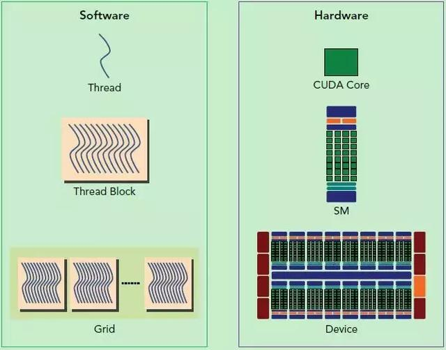
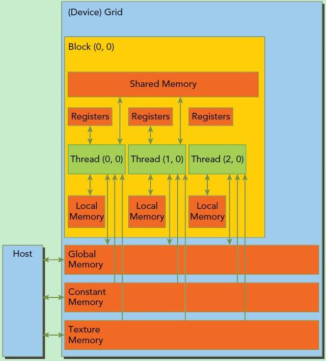

# CUDA学习笔记
## Hello CUDA
### 基本概念

- host:CPU及其内存
- device:GPU及其内存

**典型的CUDA程序执行流程：**
- 分配host内存,并进行数据初始化; 
- 分配device内存,并从host将数据拷贝到device上;
- 调用CUDA的核函数在device上完成运算
- 释放device和host上分配的内存

> **kernal的线程层次结构**
> - 一个kernel所启动的所有线程称为一个网格（grid), 同一个网格上的线程共享相同的全局内存空间，grid是线程结构的第一层次
> - 一个网格里面有很多线程块block，这是第二个层次
> - 期中grid和block都是定义为dim3的变量。例如：（意思应该是说有3*2个block,每个block里面4\*3个线程）

```C
dim3 grid(3, 2);
dim3 block(4, 3);
kernel_fun<<< grid, block >>>(prams...); 
```

核函数在调用时需要用<<<grid,block>>>来制定要执行的线程数量。每个线程都有一个唯一的线程号threadIdx。

GPU的一个核心组件是SM(Streaming Multiprocessor，流式多处理器)。当一个kernal被执行时，它的grid中的线程块被分配到SM上，一个线程块只能在一个SM上被调度。每个SM上一般可以调度多个线程块。有可能一个kernal中的线程块被分配到不同的SM上。所以grid只是逻辑层。

SM采用的是SIMT（Single-Instruction, Mutiple-Thread 单指令多线程)架构，基本的执行单元是线程束（wraps),线程束包含32个线程。这些线程同时执行相同的指令，但是每个线程都包含自己的指令地址计数器和寄存器状态，也有独立的执行路径.GPU规定线程束中的所有线程在同一周期执行相同指令，所以遇到分支结构等，执行快的会等待执行慢的。

**线程块**被划分到某SM上时，它将进一步划分为多个线程束。因为资源限制，SM同时并发的线程束是有限的，SM要为每个**线程块**分配贡献内存，为**线程**分配独立的寄存器。**线程块block**的大小一般要设置成32的倍数。



比如...我台式电脑点屏幕的显卡：
    
    使用GPU device 0: GeForce GTX 750 Ti
    SM的数量：5
    每个线程块的共享内存大小：48 KB
    每个线程块的最大线程数：1024
    每个SM的最大线程数：2048
    每个SM的最大线程束数：64

#### 内存模型


内存模型如上图所示，每个Block有一个共享内存，每个Thread有独立内存。所有的线程都可以访问全局内存(Global Memory)。还可以访问一些只读内存块:常量内寸，纹理内存。

### Demo
如果不检查过程中有没有错误，两个向量相加的代码可以简化成：
```C
__global__ void addKernel(int *c, const int *a, const int *b)
{
    int i = threadIdx.x;
    c[i] = a[i] + b[i];
}

void addWithCuda(int *c, const int *a, const int *b, unsigned int size)
{
    int *dev_a = 0;
    int *dev_b = 0;
    int *dev_c = 0;
    cudaError_t cudaStatus;

    // Choose which GPU to run on, change this on a multi-GPU system.
    cudaStatus = cudaSetDevice(0);
    // Allocate GPU buffers for three vectors (two input, one output)    .
    cudaStatus = cudaMalloc((void**)&dev_c, size * sizeof(int));
    cudaStatus = cudaMalloc((void**)&dev_a, size * sizeof(int));
    cudaStatus = cudaMalloc((void**)&dev_b, size * sizeof(int));
    // Copy input vectors from host memory to GPU buffers.
    cudaStatus = cudaMemcpy(dev_a, a, size * sizeof(int), cudaMemcpyHostToDevice);
    cudaStatus = cudaMemcpy(dev_b, b, size * sizeof(int), cudaMemcpyHostToDevice);
    // Launch a kernel on the GPU with one thread for each element.
    addKernel<<<1, size>>>(dev_c, dev_a, dev_b);
    // cudaDeviceSynchronize waits for the kernel to finish, and returns
    // any errors encountered during the launch.
    cudaStatus = cudaDeviceSynchronize();
    // Copy output vector from GPU buffer to host memory.
    cudaStatus = cudaMemcpy(c, dev_c, size * sizeof(int), cudaMemcpyDeviceToHost);
    cudaFree(dev_c);
    cudaFree(dev_a);
    cudaFree(dev_b);
}

```


